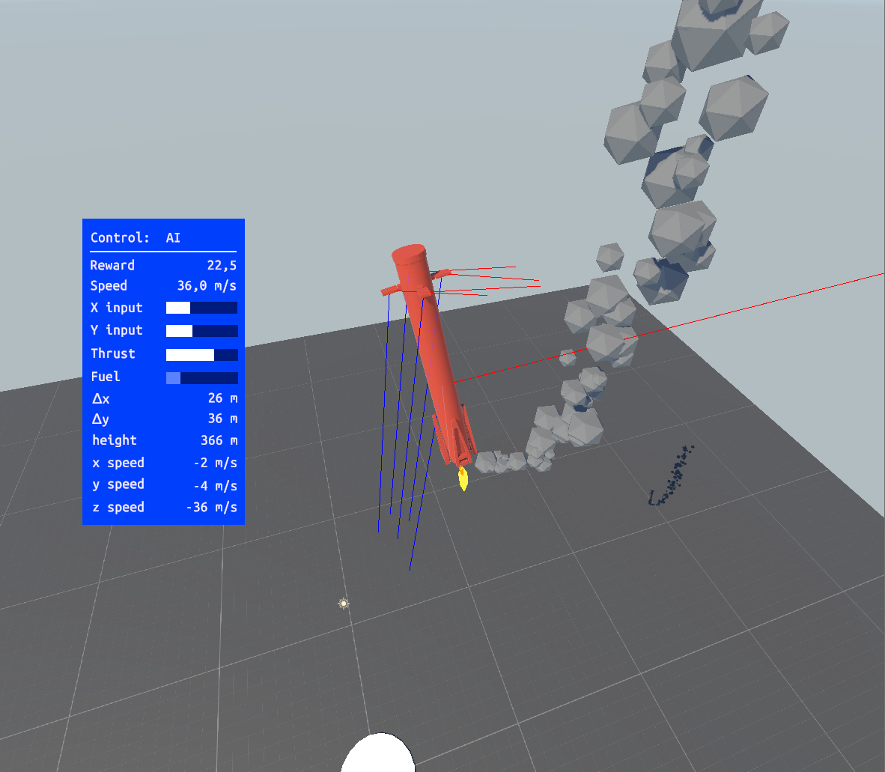

# Training Rockets to Fly Using Reinforcement Learning
The project aims to teach a virtual rocket how to land itself like the SpaceX Falcon 9. Both the rocket simulation and machine learning is done using Unity. The project contains two scenarios: a rocket that tries to hit a target above the launch pad, and a Falcon 9 style lander that attempts to land softly on a small platform below. The image below shows the lander in flight.

You can see a video of the lander by clicking on the image below.

